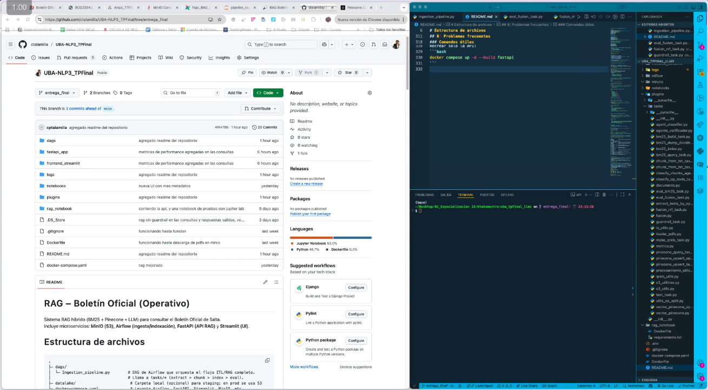
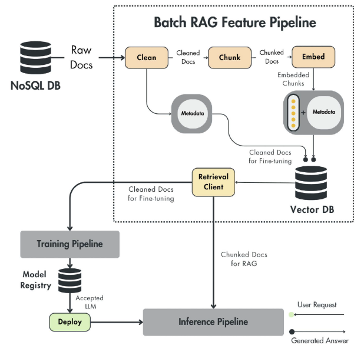
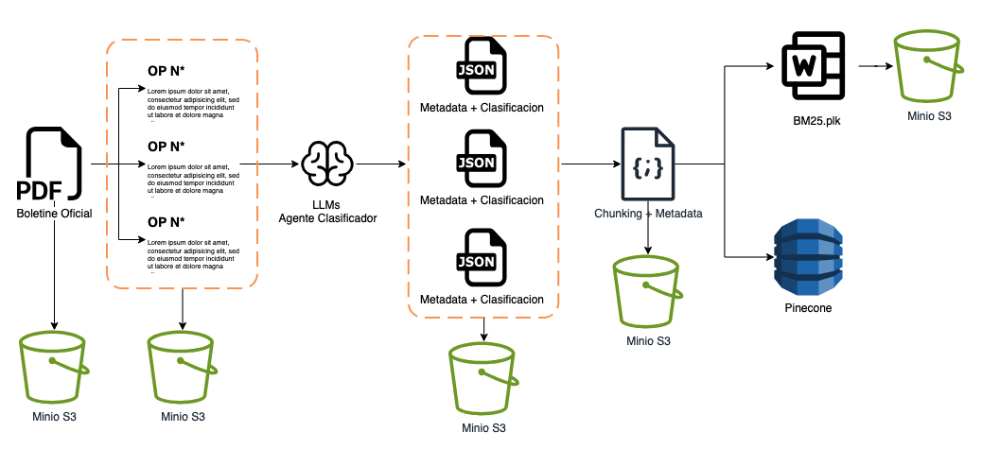

# RAG – Boletín Oficial de Salta

Sistema RAG híbrido (BM25 + Pinecone + LLM) para consultar el Boletín Oficial de Salta.  
Stack completo con orquestación en Airflow, almacenamiento en MinIO (S3), API en FastAPI y frontend en Streamlit.
A continuación un video explicativo.
[](https://drive.google.com/file/d/1Wss4I4zJwlMydGc2-BnwthNEwQ-NOZz9/view?usp=drive_link)

---

## 📋 Tabla de Contenidos

- [Arquitectura](#-arquitectura)
- [Estructura del Proyecto](#-estructura-del-proyecto)
- [Requisitos](#-requisitos)
- [Configuración](#-configuración)
- [Despliegue](#-despliegue)
- [Uso](#-uso)
- [Estructura de Datos en MinIO](#-estructura-de-datos-en-minio)
- [Troubleshooting](#-troubleshooting)

---
## 📖 Introducción

Este proyecto implementa un sistema RAG (Retrieval-Augmented Generation) de producción para consultar el Boletín Oficial de la provincia de Salta, Argentina. El sistema permite realizar búsquedas semánticas sobre ordenanzas provinciales (OPs) y obtener respuestas contextualizadas generadas por LLMs.

### Características Principales

- **Recuperación Híbrida**: Combina BM25 (búsqueda léxica) + embeddings vectoriales (búsqueda semántica) mediante Reciprocal Rank Fusion (RRF)
- **Clasificación Automática**: Agente LLM que clasifica y extrae metadatos de cada OP
- **Chunking Inteligente**: Segmentación orientada a OPs para preservar contexto legal
- **Verificación de Respuestas**: Guardrails de entrada/salida para prevenir alucinaciones
- **Métricas de Calidad**: Evaluación automática con AP@k, nDCG@k, Recall@k y MRR
- **Pipeline Batch**: Procesamiento por lotes orquestado con Airflow
- **Inference API**: FastAPI con latencias <5s y costos monitoreados

### Inspiración y Metodología

Este proyecto sigue las mejores prácticas del libro **"LLM Engineer's Handbook: Master the art of engineering large language models from concept to production"** de Paul Iusztin, Maxime Labonne y Julien Chaumond (Packt Publishing).

<div align="center">
  
</div>

El diseño del pipeline se basa en el patrón **Batch RAG Feature Pipeline** descrito en el libro, adaptado al caso específico de documentos legales estructurados:

<div align="center">
  
  <p><em>Figura: Pipeline RAG genérico (fuente: LLM Engineer's Handbook)</em></p>
</div>

**Adaptaciones clave al dominio legal:**
- **Raw Docs → PDFs del Boletín Oficial** (fuente única, formato consistente)
- **Clean → Extracción y split por OP** (cada ordenanza provincial es una unidad lógica)
- **Metadata Enrichment → Clasificación con LLM** (categoría, fechas, extractos relevantes)
- **Chunk → Segmentación contextual** (mantiene coherencia dentro de cada OP)
- **Embed → Vectorización con MiniLM** (modelo multilingüe optimizado para español)
- **Dual Indexing → BM25 + Pinecone** (recuperación híbrida para máxima cobertura)

---

## 🔄 Pipeline de Ingesta

El flujo completo de datos desde el PDF original hasta los índices de recuperación:

<div align="center">
  
  <p><em>Figura: Arquitectura del pipeline de procesamiento e indexación</em></p>
</div>

### Etapas del Pipeline

1. **Extracción por OP** 📄
   - Input: PDF del Boletín Oficial (ej: `22044_2025-10-02.pdf`)
   - Output: TXT individuales por OP + metadata JSON
   - Storage: `s3://respaldo2/rag/text_op/` y `text_op_meta/`

2. **Clasificación Automática** 🧠
   - Agent LLM analiza cada OP y extrae:
     - Categoría (edictos, licitaciones, resoluciones, etc.)
     - Entidades mencionadas (personas, empresas, expedientes)
     - Fechas relevantes
     - Resumen ejecutivo
   - Output: JSON enriquecido con clasificación
   - Storage: Mismo path que metadata, campo `classification`

3. **Chunking Contextual** ✂️
   - Segmentación respetando límites de OP
   - Cada chunk mantiene metadata del boletín y OP origen
   - Output: NDJSON con formato:
```json
 {"chunk_id": "22044::OP100128767::1", "text": "...", "metadata": {...}}
```
   - Storage: `s3://respaldo2/rag/chunks_op/2025/`
4. **Indexación Dual** 🔍
   - **BM25**: Índice léxico para búsqueda por términos exactos
     - Storage: `s3://respaldo2/rag/models/2025/bm25.pkl`
   - **Pinecone**: Base vectorial para búsqueda semántica
     - Index: `boletines-2025` (dimensión: 384, MiniLM)
     - Namespace: `2025`

5. **Evaluación (Opcional)** 📊
   - Métricas de ranking contra ground truth (qrels.csv)
   - Reportes en `s3://respaldo2/rag/metrics/`

---

## 🏗 Arquitectura

El sistema se compone de **15 servicios** en Docker Compose:

### **Orquestación y Procesamiento (Airflow)**
- `postgres` - Base de datos PostgreSQL para Airflow
- `redis` - Cola de mensajes para CeleryExecutor
- `airflow-webserver` - UI de Airflow (puerto **8080**)
- `airflow-scheduler` - Planificador de DAGs
- `airflow-worker` - Worker de Celery para ejecutar tasks
- `airflow-triggerer` - Manejo de triggers asíncronos
- `airflow-init` - Inicialización automática (DB, usuario admin)
- `airflow-cli` - CLI de Airflow (profile `debug`)
- `flower` - Monitor de Celery (puerto **5555**, profile `flower`)

### **Almacenamiento y ML**
- `minio` - S3-compatible storage (API: **9000**, Console: **9001**)
- `init-minio` - Crea bucket `respaldo2` automáticamente
- `mlflow` - MLflow tracking server (puerto **5001**)

### **RAG y Frontend**
- `rag_api` - FastAPI con el pipeline RAG (puerto **8000**)
- `rag_notebook` - Jupyter notebook para desarrollo (puerto **8888**)
- `streamlit` - UI interactiva (puerto **8501**)

---

## 📁 Estructura del Proyecto

```text
.
├─ dags/
│  └─ Ingestion_pipeline.py        # DAG de Airflow que orquesta el flujo ETL/RAG completo.
│                                  # Llama a tasks/* (extract > chunk > index > eval).
├─ datalake/                        # Carpeta local (opcional) para staging; en prod se usa S3/MinIO.
├─ docker-compose.yaml              # Levanta Airflow, FastAPI, Streamlit, MinIO, etc.
├─ Dockerfile                       # Imagen base (raíz) – útil para notebooks o jobs sueltos.

├─ fastapi_app/
│  ├─ Dockerfile                    # Imagen del microservicio de consulta.
│  ├─ main.py                       # Endpoints (/health, /ask, /query, /vector/query, /eval/*).
│  ├─ performance.py                # Endpoints/útiles para medir latencias y throughput.
│  ├─ pipeline.py                   # Pipeline RAG híbrido (BM25 + Pinecone + RRF + LLM).
│  ├─ requirements.txt
│  ├─ s3_boto.py                    # Cliente S3/MinIO para leer bm25.pkl y NDJSON de chunks.
│  └─ vector_pinecone_api.py        # Helper de Pinecone (ensure_index, query con embeddings).

├─ frontend_streamlit/
│  ├─ Dockerfile
│  ├─ requirements.txt
│  └─ streamlit_app.py              # UI simple para probar RAG (muestra chunk_id/source/score/…).

├─ mlflow/
│  └─ artifacts/                    # Artefactos de experimentos (si usás MLflow localmente).
├─ mlruns/                           # Metadatos de MLflow (experimentos, runs).

├─ notebooks/
│  └─ pipeline_rag.ipynb            # Notebook de prototipado: chunking, fusión RRF, pruebas locales.

├─ plugins/
│  ├─ __init__.py
│  └─ tasks/                        # “Librería de tareas” usada por Airflow y scripts.
│     ├─ agent_classifier.py        # Clasificador LLM/heurístico por OP (categoría, extraídos).
│     ├─ agente_verificador.py      # Verificaciones/guardrails con LLM (si aplica).
│     ├─ bm25_build_task.py         # Construye índice BM25 (bm25.pkl) desde NDJSON.
│     ├─ bm25_dump_docids_task.py   # Exporta mapping de doc_ids (debug/diagnóstico).
│     ├─ bm25_index.py              # Implementación BM25Index (search, doc_ids, persistencia).
│     ├─ bm25_query_task.py         # Consulta de prueba contra el BM25.
│     ├─ chunk_from_txt_task_op.py  # Chunker “OP-first”: agrupa por boletín/op y emite NDJSON.
│     ├─ chunk_from_txt_task.py     # Chunker “plain”: un NDJSON por PDF base (modo legacy).
│     ├─ classify_chunks_agent_task.py # Clasifica chunks ya generados (etiquetas).
│     ├─ classify_op_texts_task.py  # Extrae + clasifica cada OP desde TXT crudo.
│     ├─ documents.py               # Clase Document + chunk_text (lógica de segmentación).
│     ├─ eval_bm25_task.py          # Métricas sobre BM25 (recall@k, mrr, etc.).
│     ├─ eval_fusion_task.py        # Eval de fusión RRF (AP@k, nDCG@k, Recall@k, MRR).
│     ├─ extract_texts_by_op_task.py# Crea text_op/ y text_op_meta/ desde PDFs o fuentes.
│     ├─ fusion_rrf_task.py         # Ejecuta RRF (BM25 + vector) y guarda resultados en rag/fusion/.
│     ├─ fusion.py                  # Implementación pura de RRF (función rrf_combine).
│     ├─ guardrail_task.py          # Detección de prompt-injection/ruido en chunks.
│     ├─ io_utils.py                # Utilidades de IO locales.
│     ├─ loader_pdfs.py             # PDF→Document (limpieza, normalización, dehyphen, etc.).
│     ├─ make_qrels_task.py         # Construye qrels.csv (ground truth) para evaluación.
│     ├─ metrics.py                 # Métricas de ranking (AP, nDCG, Recall, MRR…).
│     ├─ pinecone_query_task.py     # Consulta vectorial de prueba (top_k) desde Airflow/script.
│     ├─ pinecone_upsert_op_task.py # Upsert a Pinecone desde NDJSON “OP-first” (con metadatos extra).
│     ├─ pinecone_upsert_task.py    # Upsert a Pinecone desde NDJSON legacy.
│     ├─ procesamiento_utils.py     # Limpieza, normalización, helpers de texto.
│     ├─ qrels_utils.py             # Lectura/parseo de qrels.
│     ├─ s3_utilities.py            # Listar/leer/subir a S3 (read_text, upload_json, list_keys…).
│     ├─ s3_utils.py                # Compat/atajos S3 (antiguo).
│     ├─ text_task.py               # Tareas misceláneas de texto.
│     ├─ utils_op_split.py          # Split de documentos en OPs (nombres, patrones).
│     ├─ vector_pinecone_op.py      # Cliente Pinecone orientado a OP (IDs, namespaces).
│     └─ vector_pinecone.py         # Cliente Pinecone genérico (ensure_index, upsert, query).

├─ rag_notebook/
│  ├─ Dockerfile
│  └─ requirements.txt              # Entorno liviano para reproducir el notebook.

└─ README.md                        # Cómo correr, variables de entorno, flujo E2E.

```

---

## ✅ Requisitos

- **Docker** + **Docker Compose** v2.x
- **(Opcional)** `jq` para formatear respuestas JSON en terminal

---

## ⚙️ Configuración

### 1. Crear archivo `.env`

Crea un archivo `.env` en la raíz del proyecto con las siguientes variables:

```bash
# ========================================
# MinIO / S3
# ========================================
S3_ENDPOINT_URL=http://minio:9000                    # URL interna (desde containers)
S3_ENDPOINT_URL_HOST=http://localhost:9000           # URL desde el host
AWS_ACCESS_KEY_ID=minio_admin                        # ⚠️ Usuario MinIO (ver docker-compose)
AWS_SECRET_ACCESS_KEY=minio_admin                    # ⚠️ Password MinIO
AWS_DEFAULT_REGION=us-east-1
S3_BUCKET=respaldo2                                  # Bucket creado automáticamente
S3_USE_SSL=false

# ========================================
# OpenAI
# ========================================
OPENAI_API_KEY=sk-proj-XXXXXXXXXXXXXXXXXXXXXXXX     # ⚠️ OBLIGATORIO
OPENAI_MODEL=gpt-4o-mini                            # Modelo por defecto
OPENAI_GUARD_MODEL=gpt-4o-mini                      # Guardrail de entrada
OPENAI_SUMMARY_MODEL=gpt-4o-mini                    # Resumen de contexto
OPENAI_ANSWER_MODEL=gpt-4o-mini                     # Generación de respuesta
OPENAI_OUT_GUARD_MODEL=gpt-4o-mini                  # Verificación de salida

# ========================================
# Pinecone
# ========================================
PINECONE_API_KEY=pcsk_XXXXXXXX                      # ⚠️ OBLIGATORIO
PINECONE_CLOUD=aws                                  # o 'gcp'
PINECONE_REGION=us-east-1                           # Región del índice
PINECONE_INDEX=boletines-2025                       # Nombre del índice
PINECONE_NAMESPACE=2025                             # Namespace (opcional)
PINECONE_ENVIRONMENT=us-east1-gcp                   # Solo si usás pod-based

# ========================================
# Embeddings
# ========================================
EMB_MODEL=sentence-transformers/paraphrase-multilingual-MiniLM-L12-v2  # ⚠️ Dimensión: 384

# ========================================
# Rutas en S3 (generadas por Airflow)
# ========================================
BM25_MODEL_KEY=rag/models/2025/bm25.pkl            # Índice BM25 serializado
CHUNKS_PREFIX=rag/chunks_op/2025/                  # NDJSON de chunks por boletín

# ========================================
# Airflow (usuarios admin)
# ========================================
_AIRFLOW_WWW_USER_USERNAME=airflow
_AIRFLOW_WWW_USER_PASSWORD=airflow

# ========================================
# Puertos (informativo)
# ========================================
# Airflow:     http://localhost:8080
# FastAPI:     http://localhost:8000
# Streamlit:   http://localhost:8501
# MinIO API:   http://localhost:9000
# MinIO UI:    http://localhost:9001
# MLflow:      http://localhost:5001
# Jupyter:     http://localhost:8888
# Flower:      http://localhost:5555 (con --profile flower)
```

> **⚠️ IMPORTANTE**: Las credenciales de MinIO son `minio_admin` / `minio_admin` (definidas en `docker-compose.yaml`). El servicio `init-minio` crea el bucket `respaldo2` automáticamente al iniciar.

---

## 🚀 Despliegue

### Opción 1: Levantar todo el stack

```bash
docker compose up -d --build
```

**Servicios disponibles:**

| Servicio | URL | Credenciales |
|----------|-----|--------------|
| **Airflow UI** | http://localhost:8080 | `airflow` / `airflow` |
| **FastAPI** | http://localhost:8000 | - |
| **Streamlit** | http://localhost:8501 | - |
| **MinIO Console** | http://localhost:9001 | `minio_admin` / `minio_admin` |
| **MLflow** | http://localhost:5001 | - |
| **Jupyter Notebook** | http://localhost:8888 | Sin token (dev only) |

### Opción 2: Levantar servicios selectivos

```bash
# Solo infraestructura básica
docker compose up -d postgres redis minio

# Airflow + API + UI
docker compose up -d airflow-webserver airflow-scheduler airflow-worker rag_api streamlit

# Con Flower (monitor de Celery)
docker compose --profile flower up -d
```

---

## 🎯 Uso

### 1. **Inicializar Airflow** (automático)

El servicio `airflow-init` se ejecuta automáticamente y:
- Inicializa la base de datos
- Crea el usuario admin (`airflow` / `airflow`)
- Configura permisos de carpetas

**No se requiere ningún comando manual.**

### 2. **Configurar conexión MinIO en Airflow**

1. Acceder a **http://localhost:8080** (user: `airflow`, pass: `airflow`)
2. Ir a **Admin → Connections**
3. Crear/editar conexión:
   - **Conn Id**: `minio_s3`
   - **Conn Type**: `Amazon Web Services`
   - **Extra** (JSON):
     ```json
     {
       "endpoint_url": "http://minio:9000",
       "region_name": "us-east-1",
       "aws_access_key_id": "minio_admin",
       "aws_secret_access_key": "minio_admin"
     }
     ```

> **Nota**: El docker-compose define `AIRFLOW_CONN_MINIO_S3` en variables de entorno, por lo que esta conexión puede estar pre-configurada.

### 3. **Ejecutar el pipeline de ingesta**

1. En Airflow UI, habilitar el DAG `Ingestion_pipeline`
2. Hacer clic en "Trigger DAG"
3. El pipeline ejecutará:
   - **Extracción**: PDF → TXT por OP
   - **Chunking**: TXT → NDJSON con metadatos
   - **Indexación**: Construcción de `bm25.pkl` + upsert a Pinecone
   - **Evaluación**: Métricas de ranking (opcional)

**Resultado**: Los archivos `bm25.pkl` y `*.ndjson` se subirán a MinIO en `s3://respaldo2/rag/`.

---

## 🔍 Consultar la API RAG

### Health check

```bash
curl -s http://localhost:8000/health | jq
```

### Consulta simple (GET)

```bash
curl -s "http://localhost:8000/ask?q=CASTRO,%20MARIA%20EUGENIA%20en%20que%20OP%20se%20menciona" | jq .answer
```

### Consulta completa con métricas (POST)

```bash
curl -X POST "http://localhost:8000/query" \
  -H "Content-Type: application/json" \
  -d '{
    "query": "CASTRO, MARIA EUGENIA en que OP y boletin se menciona?",
    "k_final": 3
  }' | jq
```

**Respuesta incluye:**
- `answer`: Respuesta generada por LLM
- `verification`: Verificación de hallazgos (✅ respaldada / ⚠️ parcial / ❌ contradictoria)
- `results`: Top-k chunks con scores híbridos (BM25 + vector + RRF)
- `performance`: Desglose de latencias por componente (ms)
- `cost`: Costo estimado en USD (tokens OpenAI)

**Ejemplo de performance:**
```json
{
  "total_time": 11.945,
  "breakdown": {
    "bm25_time": 0.014,
    "vector_time": 1.132,
    "fusion_time": 0.0,
    "llm_summary_time": 3.99,
    "llm_answer_time": 2.745,
    "llm_verification_time": 3.967
  },
  "cost": { "total_usd": 0.000704 }
}
```

### Ver metadatos de un resultado

```bash
curl -s -X POST "http://localhost:8000/query" \
  -H "Content-Type: application/json" \
  -d '{"query": "expediente 123", "k_final": 1}' \
  | jq '.results[0].metadata'
```

**Ejemplo de metadata:**
```json
{
  "chunk_id": "22044_2025-10-02::p1::2",
  "source": "boletines/2025/22044_2025-10-02.pdf",
  "boletin": "22044",
  "fecha": "2025-10-02",
  "op": "100128767",
  "ndjson_key": "rag/chunks_op/2025/22044_2025-10-02.ndjson"
}
```

### Otros endpoints

- `POST /vector/query` - Consulta directa al índice vectorial (sin BM25)
- `GET /eval/precision` - Métricas de precisión contra qrels
- `GET /eval/recall` - Métricas de recall

---

## 💻 UI con Streamlit

Acceder a **http://localhost:8501**

La interfaz permite:
- Hacer preguntas en lenguaje natural
- Ver chunks recuperados con scores
- Inspeccionar metadatos (boletín, OP, fecha)
- Visualizar tiempos de respuesta

> La variable `RAG_API_URL` en el container apunta a `http://rag_api:8000` (DNS interno del compose).

---

## 📊 Jupyter Notebook (Desarrollo)

Acceder a **http://localhost:8888** (sin token)

El servicio `rag_notebook` tiene acceso a:
- Código de `fastapi_app/` (modo read-only)
- Módulos de `plugins/tasks/` (índices, fusión, métricas)
- Variables de entorno de S3, Pinecone y OpenAI

Útil para:
- Prototipado de chunking strategies
- Pruebas de fusión RRF
- Análisis de embeddings

---

## 🗄 Estructura de Datos en MinIO

**Bucket**: `respaldo2`

```
rag/
├─ models/
│  └─ 2025/
│     └─ bm25.pkl                          # Índice BM25 serializado (pickle)
│
├─ chunks_op/                              # 📁 NDJSON generado por pipeline
│  └─ 2025/
│     ├─ 22043_2025-10-01.ndjson           # Chunks del boletín 22043
│     ├─ 22044_2025-10-02.ndjson
│     └─ ...
│
├─ chunks_op_curated/                      # 📁 NDJSON corregido manualmente
│  └─ 2025/
│
├─ text_op/                                # 📁 Texto crudo por OP
│  └─ 2025/
│     └─ 22047_OP100129085_2025-10-07.txt
│
├─ text_op_meta/                           # 📁 Metadatos por OP (JSON)
│  └─ 2025/
│     └─ 22047_OP100129085_2025-10-07.json
│
├─ fusion/                                 # 📁 Resultados de búsquedas RRF
│  └─ 2025/
│     └─ fusion_<query>_<timestamp>.json
│
├─ metrics/                                # 📁 Evaluaciones (AP@k, nDCG@k, MRR)
│  └─ 2025/
│     └─ fusion_eval_<query>.json
│
└─ qrels/                                  # 📁 Ground truth para evaluación
   └─ 2025/
      └─ qrels.csv
```

---

## 🛠 Troubleshooting

### Error: "No module named 'tasks'"

**Causa**: PYTHONPATH no incluye `plugins/` o `fastapi_app/`

**Solución**: Verificar en `docker-compose.yaml` que los volúmenes estén montados:
```yaml
volumes:
  - ./plugins/tasks:/code/tasks
  - ./fastapi_app:/code/fastapi_app
environment:
  PYTHONPATH: /code
```

### Error: "⚠️ OPENAI_API_KEY no configurada"

**Solución**: Agregar en `.env`:
```bash
OPENAI_API_KEY=sk-proj-XXXXXXXXXXXXXXXX
```

### Error: Pinecone "dimension mismatch"

**Causa**: El índice fue creado con una dimensión diferente a 384

**Solución**: 
1. Eliminar el índice en Pinecone
2. Crear uno nuevo con `dimension=384`
3. Ejecutar el pipeline de ingesta nuevamente

### No se encuentran resultados en la API

**Diagnóstico**:
```bash
# Verificar que exista bm25.pkl
aws --endpoint-url http://localhost:9000 s3 ls s3://respaldo2/rag/models/2025/

# Verificar que existan chunks
aws --endpoint-url http://localhost:9000 s3 ls s3://respaldo2/rag/chunks_op/2025/
```

**Solución**: Ejecutar el DAG `Ingestion_pipeline` en Airflow.

### Conexión rechazada desde la API a MinIO

**Causa**: La API intenta conectarse a `localhost:9000` en lugar de `minio:9000`

**Solución**: En `.env`, verificar:
```bash
S3_ENDPOINT_URL=http://minio:9000  # DNS interno del compose
```

### Ver logs de un servicio

```bash
# Logs en tiempo real
docker compose logs -f rag_api
docker compose logs -f airflow-scheduler

# Logs de todos los servicios
docker compose logs --tail=100
```

### Reiniciar solo un servicio

```bash
docker compose restart rag_api
docker compose up -d --build rag_api  # con rebuild
```

### Limpiar todo y empezar de cero

```bash
docker compose down -v  # elimina volúmenes
docker compose up -d --build
```

---

## 📦 Flujo de Trabajo Típico

1. **Desarrollo**:
   - Prototipar en `notebooks/pipeline_rag.ipynb` (Jupyter)
   - Refinar chunking en `plugins/tasks/chunk_*.py`
   - Probar fusión RRF localmente

2. **Ingesta**:
   - Subir PDFs a MinIO (manual o automatizado)
   - Ejecutar DAG `Ingestion_pipeline` en Airflow
   - Validar que se generen `bm25.pkl` y `*.ndjson`

3. **Consulta**:
   - Usar Streamlit para pruebas interactivas
   - Usar FastAPI directamente para integraciones
   - Monitorear `performance` y ajustar parámetros

4. **Evaluación**:
   - Crear `qrels.csv` con relevancias ground truth
   - Ejecutar tasks de evaluación (`eval_fusion_task.py`)
   - Revisar métricas en `rag/metrics/`

---

## 🧪 Comandos Útiles

```bash
# Estado de los servicios
docker compose ps

# Logs de un servicio específico
docker compose logs -f streamlit

# Ejecutar comando en un container
docker compose exec rag_api bash

# Ver uso de recursos
docker stats

# Limpiar imágenes no usadas
docker image prune -a

# Backup de la DB de Airflow
docker compose exec postgres pg_dump -U airflow airflow > airflow_backup.sql
```

---

## 📝 Notas Adicionales

- **Seguridad**: Este setup es para desarrollo local. En producción, cambiar credenciales, habilitar SSL y usar secrets.
- **Escalado**: Para mayor throughput, aumentar `airflow-worker` replicas o cambiar a KubernetesExecutor.
- **Costos**: Monitorear `cost.total_usd` en las respuestas de la API para estimar gastos en OpenAI.
- **MLflow**: El tracking server guarda experimentos en `./mlflow/`. Útil para versionar modelos y parámetros.

---

## 🤝 Contribuciones

Este proyecto es parte del **Trabajo Final de NLP (UBA)**.  
Para reportar issues o sugerir mejoras, abrir un issue en el repositorio.

---

## 📄 Licencia

Ver `LICENSE` en el repositorio.